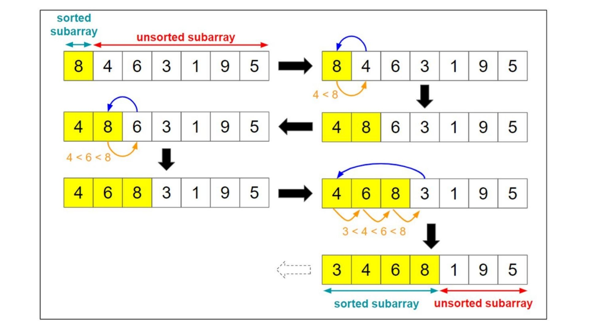

insertion sort is all about inserting in a list but keeps it sorted as we insert elements to it and instead of creating new list and consuming space the algorithm implmentaiton suggests inserts into the same list to be sorted with the help of subarray(sublist) colored as yellow in the image above, so we have a sorted yellow subarray and unsorted uncolored one after inserting all the elements form the unsorted to the sorted list we have already sorted our list

How insertion works ?
suppose we have one list [4, 8] and we want to insert new element 6 in it the new list should be of three elements [4, 8, ..] we created a space for a new element and again we iterate, compare and swap if bigger so we have [4, 6, 8] as shown above in the picture.

Note that Insertion sort is more suitable for linked lists as insertion is more intuitive using linked lists and it fits better using this data structure


## pseudo code time!

  

```
function insertionSort(list, listLength)
{
    for (i = 1; i < n; i++)
    {
        x = list[i];
        for (j = i - 1; j > -1 and list[j] > x; j--)
        {
            list[j + 1] = list[j];   
        }
        list[j + 1] = x;
    }
}
```


Analysis
1) Number of comparisons -> O(n^2)

2) Number of swaps -> O(n^2)

3) Adaptive : yes it's adaptive and furthermore it's an adaptive by nature algorithms as we didn't need some flag to ensure that behaviour

4) Stable: it's a stable algorithms as in case of equal elements it keeps the original sorting and not swapping, it only swaps in case of (bigger than >)

5) Memory: no extra memory needed just the original list to be sorted